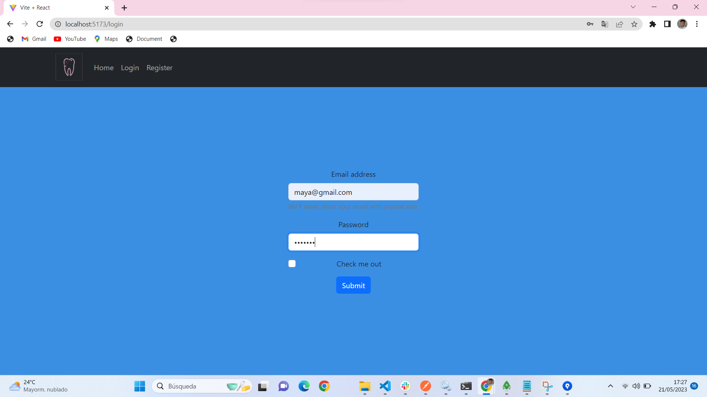
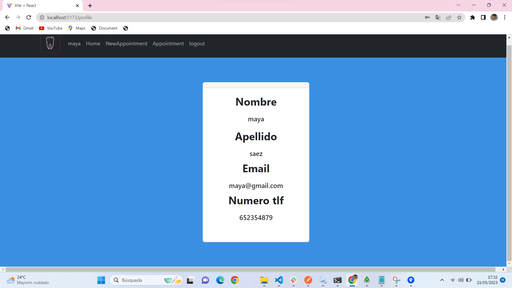

# Dental Clinic

Project focused in create a Denatal Clinic Website with React  implementing all kinds of functionalities

I leave here the administrator user to have access to everything

https://carlossabrido.github.io/ClinicaDental/

yamal@gmail.com

password:yamal123

# Functionality

First of all here whe have the main page, the one that you see as normal person searching in google

If you are not registered yet you must do to get access

Rigth after get registered the website take you to the login page.

 it´s time to log in to have a look into tha website

 

 Once we are into the website we can check our profile information

 

 And also we can interactuate with the website, let´s create an appointment

 

 Once that we have created an appointment let´s see our appointment

 

 if you make any mistake doing this you can modify the appointment

 

 As a dentist, you can do the same but if you have Admin´s profile you will be able create dentist´s account 

 

 and algo visualize all the profiles 

 

 

# Technologies used

  
  
  

# Inquires 

Proyect developed in a team if you got any inquires get in touch by Linkedn with any of us:

<a href="https://www.linkedin.com/in/carlos-sabrido-medina-624b77258/"> Carlos' linkedin </a>
